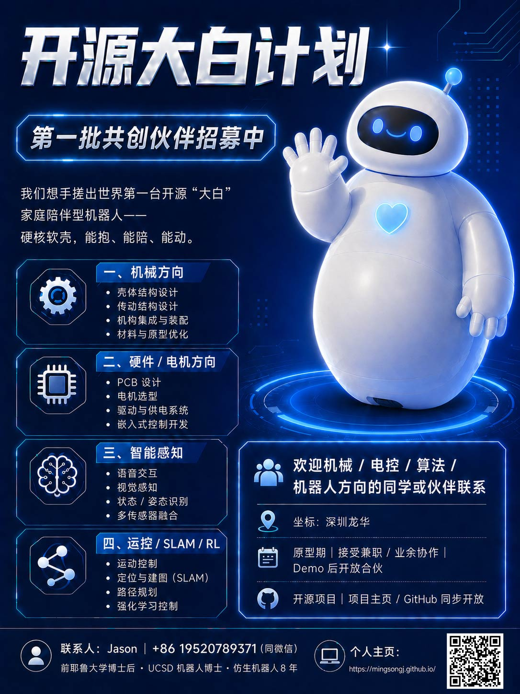

# 🤖 Open DaBai · 开源大白计划

<p align="center">
  <strong>世界第一台开源"大白"家庭陪伴型机器人</strong><br>
  The World's First Open-Source Baymax-Inspired Home Companion Robot
</p>

<p align="center">
  硬核软壳 · 能抱 · 能陪 · 能动<br>
  Soft Shell · Huggable · Companionable · Mobile
</p>

<p align="center">
  
</p>

---

## 项目愿景 | Vision

我们的目标是打造一台真正的开源家庭陪伴机器人——像电影《超能陆战队》中的大白一样，拥有柔软安全的外壳、温暖的交互能力，并且能够自主移动。

Our goal is to build a truly open-source home companion robot — like Baymax from *Big Hero 6* — with a soft, safe shell, warm interactive capabilities, and autonomous mobility.

## 系统架构 | System Architecture

```
┌─────────────────────────────────────────────────┐
│          Layer 3: AI Brain / 大脑层              │
│   LLM 调用 · Agent 框架 · 语音交互 · 多模态决策   │
├─────────────────────────────────────────────────┤
│          Layer 2: ROS2 中间件层                  │
│   视觉感知 · SLAM · 导航 · 运动规划 · 传感器融合   │
├─────────────────────────────────────────────────┤
│          Layer 1: 硬件抽象层 / 固件层             │
│   电机驱动 · 传感器读取 · 实时控制 · micro-ROS    │
└─────────────────────────────────────────────────┘
```

## 技术路线 | Technical Roadmap

| 层级 | 模块 | 技术栈 |
|------|------|--------|
| AI Brain | LLM 对话与决策 | Claude API / LangChain / Tool Use |
| AI Brain | 语音交互 | Whisper (ASR) + ChatTTS (TTS) |
| AI Brain | 多模态理解 | 视觉 + 语音 + 传感器 → LLM 综合判断 |
| ROS2 | 视觉感知 | OpenCV / YOLO + ROS2 节点 |
| ROS2 | SLAM + 导航 | Nav2 + SLAM Toolbox |
| ROS2 | 传感器融合 | robot_localization (EKF) |
| ROS2 | 运动控制 | 自定义控制节点 + MoveIt2 |
| 固件层 | 电机 / 传感器驱动 | STM32 / ESP32 + micro-ROS |
| 固件层 | 力 / 光 / 热传感 | I2C / SPI 驱动 → micro-ROS Topic |
| 硬件 | PCB / 电路 | KiCad |
| 机械 | 本体 / 软壳 | FreeCAD / SolidWorks |

## 项目阶段 | Phases

| 阶段 | 时间 | 目标 |
|------|------|------|
| Phase 1 | 0 - 6 个月 | 核心团队组建，完成能动 + 软壳 + 基础交互的 Demo |
| Phase 2 | 6 - 12 个月 | 对接学校 / 敬老院试点应用 |
| Phase 3 | 12 个月+ | 根据试点反馈迭代，扩大开源社区 |

## 目录结构 | Project Structure

```
open-dabai/
├── brain/                    # Layer 3: AI 大脑
│   ├── llm/                  #   LLM 接口与 Agent 调用
│   ├── speech/               #   语音交互 (ASR / TTS)
│   └── decision/             #   意图理解与决策
├── ros2_ws/src/              # Layer 2: ROS2 工作空间
│   ├── dabai_bringup/        #   启动与配置
│   ├── dabai_perception/     #   视觉感知节点
│   ├── dabai_navigation/     #   SLAM + 导航
│   ├── dabai_control/        #   运动控制
│   ├── dabai_sensors/        #   传感器驱动与融合
│   └── dabai_interfaces/     #   自定义 msg / srv / action
├── firmware/                 # Layer 1: 嵌入式固件
│   ├── motor_driver/         #   电机驱动
│   ├── sensor_board/         #   传感器板固件
│   └── micro_ros_agent/      #   micro-ROS 桥接
├── mechanical/               # 机械结构设计
├── hardware/                 # PCB / 电路设计
├── simulation/               # Gazebo / Isaac Sim 仿真
├── docs/                     # 项目文档与教程
└── assets/                   # 图片、视频、宣传资料
```

## 先行应用场景 | Target Applications

- **学校** — 教育陪伴、编程教学互动
- **敬老院** — 老年人陪伴、健康提醒、情感交互
- **家庭** — 儿童陪伴、家庭助手

## 参与共创 | How to Contribute

我们正在招募第一批共创伙伴！详见 [CONTRIBUTING.md](CONTRIBUTING.md)

**我们需要的方向：**
- 机械结构工程师
- 硬件 / 电机工程师
- 嵌入式开发工程师
- 视觉 / 感知算法工程师
- 运动控制 / SLAM 工程师

## 发起人 | Founder

**Jason Jiang (蒋明松)**
- 前耶鲁大学博士后 · UCSD 机器人博士
- 仿生机器人领域 8 年经验
- 软体机器人行业专家
- 摩赛机器人 CEO

## 联系方式 | Contact

- WeChat: 19520789371
- Email: jason123jms@gmail.com
- Location: 深圳龙华

## License

本项目采用 [Apache License 2.0](LICENSE) 开源协议。
